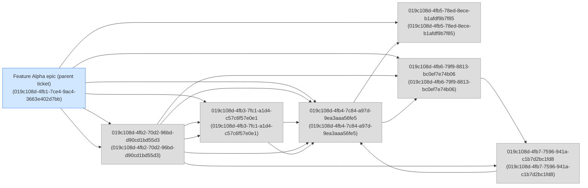

# Ticket dependency graph
_Generated at 20260130T201707.928Z UTC_

```mermaid
graph LR
  n0["Feature Alpha epic (parent ticket)\n(019c108d-4fb1-7ce4-9ac4-3663e402d7bb)"]:::status_doing
  click n0 "/.tickets/019c108d-4fb1-7ce4-9ac4-3663e402d7bb/ticket.md" "_blank"
  n1["019c108d-4fb2-70d2-96bd-d90cd1bd55d3\n(019c108d-4fb2-70d2-96bd-d90cd1bd55d3)"]:::status_todo
  click n1 "/.tickets/019c108d-4fb2-70d2-96bd-d90cd1bd55d3/ticket.md" "_blank"
  n2["019c108d-4fb3-7fc1-a1d4-c57c6f57e0e1\n(019c108d-4fb3-7fc1-a1d4-c57c6f57e0e1)"]:::status_todo
  click n2 "/.tickets/019c108d-4fb3-7fc1-a1d4-c57c6f57e0e1/ticket.md" "_blank"
  n3["019c108d-4fb4-7c84-a97d-9ea3aaa56fe5\n(019c108d-4fb4-7c84-a97d-9ea3aaa56fe5)"]:::status_todo
  click n3 "/.tickets/019c108d-4fb4-7c84-a97d-9ea3aaa56fe5/ticket.md" "_blank"
  n4["019c108d-4fb5-78ed-8ece-b1afdf9b7f85\n(019c108d-4fb5-78ed-8ece-b1afdf9b7f85)"]:::status_todo
  click n4 "/.tickets/019c108d-4fb5-78ed-8ece-b1afdf9b7f85/ticket.md" "_blank"
  n5["019c108d-4fb6-79f9-8813-bc0ef7e74b06\n(019c108d-4fb6-79f9-8813-bc0ef7e74b06)"]:::status_todo
  click n5 "/.tickets/019c108d-4fb6-79f9-8813-bc0ef7e74b06/ticket.md" "_blank"
  n6["019c108d-4fb7-7596-941a-c1b7d2bc1fd8\n(019c108d-4fb7-7596-941a-c1b7d2bc1fd8)"]:::status_todo
  click n6 "/.tickets/019c108d-4fb7-7596-941a-c1b7d2bc1fd8/ticket.md" "_blank"
  n0 --> n1
  n0 --> n2
  n0 --> n3
  n0 --> n4
  n0 --> n5
  n0 --> n1
  n1 --> n2
  n1 --> n3
  n1 --> n5
  n1 --> n2
  n2 --> n3
  n1 --> n3
  n2 --> n3
  n3 --> n4
  n3 --> n5
  n5 --> n6
  n1 --> n6
  n6 --> n3
  classDef status_todo fill:#ddd,stroke:#999;
  classDef status_doing fill:#d0e7ff,stroke:#3b82f6;
  classDef status_blocked fill:#ffe4e6,stroke:#ef4444;
  classDef status_done fill:#dcfce7,stroke:#22c55e;
  classDef status_canceled fill:#f3f4f6,stroke:#111827,color:#374151;
```